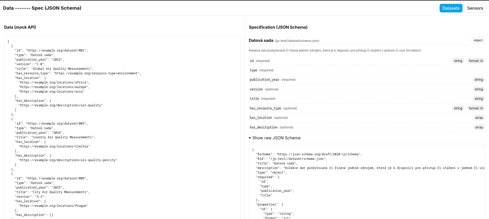
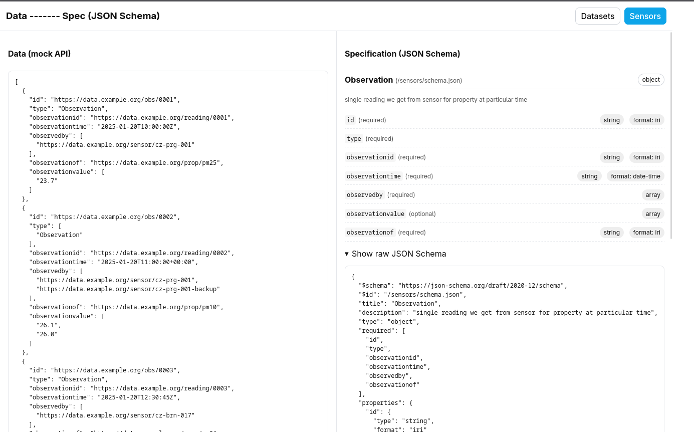

# Data -------- Spec (JSON Schema)

Side-by-side viewer that shows **data** on the left and its **JSON Schema** on the right.
Two examples included: **Datasets** and **Sensors** (mock, could be API, ...).

## Quick start

```bash
npm i
npm run dev
```


# ------------


